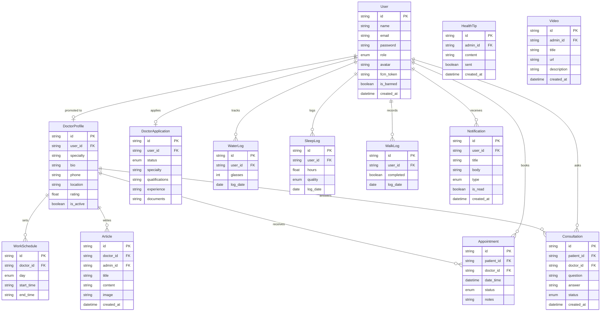
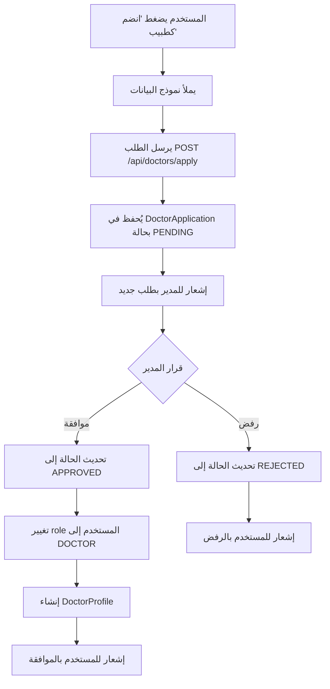
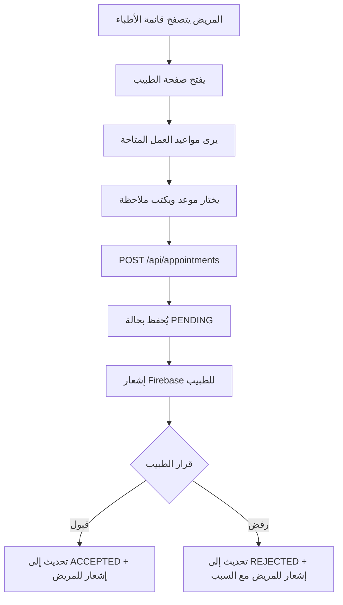
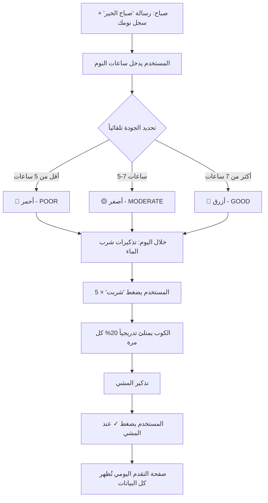

# تحليل وتخطيط منصة الرعاية الصحية - Healthcare Platform Analysis

## 1. تحليل المتطلبات (Requirements Analysis)

### 1.1 أنواع المستخدمين (User Roles)

| الدور | الوصف |
|-------|-------|
| **مستخدم عادي (User)** | يتصفح المقالات، يحسب BMI، يتابع صحته، يحجز مواعيد مع أطباء |
| **طبيب (Doctor)** | مستخدم تمت ترقيته، لديه داشبورد خاصة بإدارة المواعيد والمقالات والاستشارات |
| **مدير (Admin)** | يدير المستخدمين والأطباء، يوافق على طلبات الانضمام، ينشر محتوى |

### 1.2 الميزات حسب الدور

#### المستخدم العادي
- ✅ تسجيل دخول / إنشاء حساب
- ✅ تصفح المقالات الطبية
- ✅ حاسبة BMI
- ✅ تصفح قائمة الأطباء وعرض ملفاتهم
- ✅ حجز موعد مع طبيب + إرسال استفسار
- ✅ استلام إشعارات (قبول/رفض الموعد + نصائح صحية)
- ✅ تتبع شرب الماء (كوب يمتلئ تدريجياً × 5 مرات)
- ✅ تسجيل ساعات النوم (أحمر/أصفر/أزرق)
- ✅ تذكير المشي + تأكيد الإنجاز
- ✅ صفحة تقدم يومي شخصية
- ✅ طلب الانضمام كطبيب

#### الطبيب (ترقية من مستخدم)
- ✅ كل ميزات المستخدم العادي +
- ✅ داشبورد خاصة
- ✅ إضافة/تعديل المعلومات الشخصية والتخصص
- ✅ إدارة مواعيد العمل
- ✅ عرض مواعيد الحجز (قبول/رفض)
- ✅ الرد على استفسارات المرضى
- ✅ كتابة ونشر مقالات

#### المدير (Admin)
- ✅ داشبورد إحصائيات (أطباء، مستخدمين نشطين، استشارات)
- ✅ إدارة المستخدمين (حظر، حذف، ترقية)
- ✅ إدارة طلبات انضمام الأطباء (موافقة/رفض)
- ✅ إدارة الأطباء (حذف، تعديل)
- ✅ إضافة نصائح صحية (تُرسل كإشعارات)
- ✅ إضافة مقالات
- ✅ إضافة فيديوهات

---

## 2. هيكل المشروع (Project Architecture)

```
HelathCareGragudatedProject/
├── frontend/                    # واجهة المستخدم (PWA)
│   ├── index.html               # الصفحة الرئيسية
│   ├── manifest.json            # PWA manifest
│   ├── sw.js                    # Service Worker
│   ├── css/
│   │   └── styles.css
│   ├── js/
│   │   ├── app.js               # التطبيق الرئيسي
│   │   ├── auth.js              # تسجيل الدخول
│   │   ├── api.js               # HTTP client
│   │   ├── firebase-init.js     # Firebase setup
│   │   ├── notifications.js     # إشعارات
│   │   ├── bmi.js               # حاسبة BMI
│   │   ├── health-tracker.js    # تتبع الصحة
│   │   ├── doctors.js           # قائمة الأطباء
│   │   ├── articles.js          # المقالات
│   │   └── router.js            # SPA routing
│   ├── pages/
│   │   ├── login.html
│   │   ├── register.html
│   │   ├── home.html
│   │   ├── doctors-list.html
│   │   ├── doctor-profile.html
│   │   ├── bmi-calculator.html
│   │   ├── health-tracker.html
│   │   ├── join-doctor.html
│   │   ├── user-progress.html
│   │   ├── doctor-dashboard.html
│   │   └── admin-dashboard.html
│   └── assets/
│       ├── icons/
│       └── images/
│
├── backend/                     # الخادم
│   ├── package.json
│   ├── .env
│   ├── prisma/
│   │   └── schema.prisma        # مخطط قاعدة البيانات
│   ├── src/
│   │   ├── server.js            # Express entry point
│   │   ├── config/
│   │   │   ├── database.js      # Prisma client
│   │   │   └── firebase.js      # Firebase Admin SDK
│   │   ├── middleware/
│   │   │   ├── auth.js          # JWT middleware
│   │   │   ├── role.js          # Role-based access
│   │   │   └── upload.js        # File upload (multer)
│   │   ├── routes/
│   │   │   ├── auth.routes.js
│   │   │   ├── user.routes.js
│   │   │   ├── doctor.routes.js
│   │   │   ├── appointment.routes.js
│   │   │   ├── article.routes.js
│   │   │   ├── consultation.routes.js
│   │   │   ├── health.routes.js
│   │   │   ├── notification.routes.js
│   │   │   ├── admin.routes.js
│   │   │   └── video.routes.js
│   │   ├── controllers/
│   │   │   ├── auth.controller.js
│   │   │   ├── user.controller.js
│   │   │   ├── doctor.controller.js
│   │   │   ├── appointment.controller.js
│   │   │   ├── article.controller.js
│   │   │   ├── consultation.controller.js
│   │   │   ├── health.controller.js
│   │   │   ├── notification.controller.js
│   │   │   ├── admin.controller.js
│   │   │   └── video.controller.js
│   │   ├── services/
│   │   │   ├── auth.service.js
│   │   │   ├── notification.service.js  # Firebase push
│   │   │   └── upload.service.js
│   │   └── utils/
│   │       ├── jwt.js
│   │       └── helpers.js
│   └── uploads/                 # الملفات المرفوعة
│
└── README.md
```

---

## 3. تحليل وتصميم قاعدة البيانات (Database Schema Design)

### 3.1 مخطط العلاقات (ER Diagram)



### 3.2 Prisma Schema (كامل)

```prisma
generator client {
  provider = "prisma-client-js"
}

datasource db {
  provider = "mysql"    // أو postgresql
  url      = env("DATABASE_URL")
}

// ==========================================
// أنواع التعداد (Enums)
// ==========================================

enum Role {
  USER
  DOCTOR
  ADMIN
}

enum ApplicationStatus {
  PENDING
  APPROVED
  REJECTED
}

enum AppointmentStatus {
  PENDING
  ACCEPTED
  REJECTED
  COMPLETED
  CANCELLED
}

enum ConsultationStatus {
  PENDING
  ANSWERED
}

enum DayOfWeek {
  SUNDAY
  MONDAY
  TUESDAY
  WEDNESDAY
  THURSDAY
  FRIDAY
  SATURDAY
}

enum SleepQuality {
  POOR       // أحمر - أقل من الطبيعي
  MODERATE   // أصفر - متوسط
  GOOD       // أزرق - ممتاز
}

enum NotificationType {
  APPOINTMENT_ACCEPTED
  APPOINTMENT_REJECTED
  NEW_APPOINTMENT
  NEW_CONSULTATION
  CONSULTATION_ANSWERED
  HEALTH_TIP
  DOCTOR_APPLICATION_APPROVED
  DOCTOR_APPLICATION_REJECTED
  SYSTEM
}

// ==========================================
// جدول المستخدمين (Users)
// ==========================================

model User {
  id         String   @id @default(uuid())
  name       String
  email      String   @unique
  password   String
  role       Role     @default(USER)
  avatar     String?
  fcm_token  String?  @db.Text     // Firebase Cloud Messaging token
  is_banned  Boolean  @default(false)
  is_active  Boolean  @default(true)
  created_at DateTime @default(now())
  updated_at DateTime @updatedAt

  // علاقات المستخدم
  doctor_profile     DoctorProfile?
  doctor_application DoctorApplication?
  appointments       Appointment[]       @relation("PatientAppointments")
  consultations      Consultation[]      @relation("PatientConsultations")
  water_logs         WaterLog[]
  sleep_logs         SleepLog[]
  walk_logs          WalkLog[]
  notifications      Notification[]

  // المقالات والنصائح (للأدمن)
  admin_articles   Article[]    @relation("AdminArticles")
  admin_videos     Video[]      @relation("AdminVideos")
  admin_health_tips HealthTip[] @relation("AdminHealthTips")

  @@map("users")
}

// ==========================================
// ملف الطبيب (Doctor Profile)
// عند ترقية المستخدم إلى طبيب
// ==========================================

model DoctorProfile {
  id              String   @id @default(uuid())
  user_id         String   @unique
  specialty       String                          // التخصص
  bio             String?  @db.Text               // نبذة عن الطبيب
  phone           String?
  location        String?                          // الموقع/العيادة
  qualifications  String?  @db.Text               // المؤهلات
  experience_years Int?                            // سنوات الخبرة
  profile_image   String?                          // صورة البروفايل
  is_active       Boolean  @default(true)
  created_at      DateTime @default(now())
  updated_at      DateTime @updatedAt

  // العلاقات
  user          User           @relation(fields: [user_id], references: [id], onDelete: Cascade)
  work_schedule WorkSchedule[]
  appointments  Appointment[]  @relation("DoctorAppointments")
  articles      Article[]      @relation("DoctorArticles")
  consultations Consultation[] @relation("DoctorConsultations")

  @@map("doctor_profiles")
}

// ==========================================
// جدول مواعيد العمل (Work Schedule)
// ==========================================

model WorkSchedule {
  id         String    @id @default(uuid())
  doctor_id  String
  day        DayOfWeek                           // يوم الأسبوع
  start_time String                              // وقت البداية "09:00"
  end_time   String                              // وقت النهاية "17:00"
  is_active  Boolean   @default(true)
  created_at DateTime  @default(now())

  doctor DoctorProfile @relation(fields: [doctor_id], references: [id], onDelete: Cascade)

  @@unique([doctor_id, day])                     // جدول واحد لكل يوم لكل طبيب
  @@map("work_schedules")
}

// ==========================================
// طلبات الانضمام كطبيب (Doctor Applications)
// ==========================================

model DoctorApplication {
  id              String            @id @default(uuid())
  user_id         String            @unique
  full_name       String
  specialty       String                          // التخصص المطلوب
  qualifications  String            @db.Text      // المؤهلات العلمية
  experience_years Int                             // سنوات الخبرة
  phone           String
  location        String?
  documents_url   String?           @db.Text      // رابط الوثائق المرفقة
  bio             String?           @db.Text      // نبذة شخصية
  status          ApplicationStatus @default(PENDING)
  admin_notes     String?           @db.Text      // ملاحظات المدير
  created_at      DateTime          @default(now())
  updated_at      DateTime          @updatedAt

  user User @relation(fields: [user_id], references: [id], onDelete: Cascade)

  @@map("doctor_applications")
}

// ==========================================
// جدول المواعيد (Appointments)
// ==========================================

model Appointment {
  id         String            @id @default(uuid())
  patient_id String
  doctor_id  String
  date_time  DateTime                            // تاريخ ووقت الموعد
  status     AppointmentStatus @default(PENDING)
  notes      String?           @db.Text          // ملاحظات المريض
  reason     String?                              // سبب الزيارة
  reject_reason String?                           // سبب الرفض (إن وجد)
  created_at DateTime          @default(now())
  updated_at DateTime          @updatedAt

  patient User          @relation("PatientAppointments", fields: [patient_id], references: [id], onDelete: Cascade)
  doctor  DoctorProfile @relation("DoctorAppointments", fields: [doctor_id], references: [id], onDelete: Cascade)

  @@map("appointments")
}

// ==========================================
// جدول المقالات (Articles)
// ==========================================

model Article {
  id         String   @id @default(uuid())
  title      String
  content    String   @db.LongText              // محتوى المقال
  image      String?                             // صورة المقال
  is_published Boolean @default(true)

  // يمكن أن ينشرها طبيب أو أدمن
  doctor_id  String?
  admin_id   String?

  created_at DateTime @default(now())
  updated_at DateTime @updatedAt

  doctor DoctorProfile? @relation("DoctorArticles", fields: [doctor_id], references: [id], onDelete: SetNull)
  admin  User?          @relation("AdminArticles", fields: [admin_id], references: [id], onDelete: SetNull)

  @@map("articles")
}

// ==========================================
// جدول الاستشارات (Consultations)
// ==========================================

model Consultation {
  id         String             @id @default(uuid())
  patient_id String
  doctor_id  String
  question   String             @db.Text          // سؤال المريض
  answer     String?            @db.Text          // رد الطبيب
  status     ConsultationStatus @default(PENDING)
  created_at DateTime           @default(now())
  updated_at DateTime           @updatedAt

  patient User          @relation("PatientConsultations", fields: [patient_id], references: [id], onDelete: Cascade)
  doctor  DoctorProfile @relation("DoctorConsultations", fields: [doctor_id], references: [id], onDelete: Cascade)

  @@map("consultations")
}

// ==========================================
// جدول تتبع شرب الماء (Water Tracking)
// الكوب يمتلئ تدريجياً × 5 مرات يومياً
// ==========================================

model WaterLog {
  id        String   @id @default(uuid())
  user_id   String
  glasses   Int      @default(0)               // عدد الأكواب (0-5)
  log_date  DateTime @db.Date                  // تاريخ اليوم
  created_at DateTime @default(now())
  updated_at DateTime @updatedAt

  user User @relation(fields: [user_id], references: [id], onDelete: Cascade)

  @@unique([user_id, log_date])                // سجل واحد لكل يوم
  @@map("water_logs")
}

// ==========================================
// جدول تتبع النوم (Sleep Tracking)
// أحمر = أقل من الطبيعي، أصفر = متوسط، أزرق = ممتاز
// ==========================================

model SleepLog {
  id        String       @id @default(uuid())
  user_id   String
  hours     Float                               // عدد ساعات النوم
  quality   SleepQuality                        // تحدد تلقائياً حسب الساعات
  log_date  DateTime     @db.Date
  created_at DateTime    @default(now())
  updated_at DateTime    @updatedAt

  user User @relation(fields: [user_id], references: [id], onDelete: Cascade)

  @@unique([user_id, log_date])
  @@map("sleep_logs")
}

// ==========================================
// جدول تتبع المشي (Walk Tracking)
// ==========================================

model WalkLog {
  id        String   @id @default(uuid())
  user_id   String
  completed Boolean  @default(false)           // هل مشى اليوم؟
  steps     Int?                                // عدد الخطوات (اختياري)
  log_date  DateTime @db.Date
  created_at DateTime @default(now())
  updated_at DateTime @updatedAt

  user User @relation(fields: [user_id], references: [id], onDelete: Cascade)

  @@unique([user_id, log_date])
  @@map("walk_logs")
}

// ==========================================
// جدول النصائح الصحية (Health Tips)
// تُرسل كإشعارات للمستخدمين
// ==========================================

model HealthTip {
  id         String   @id @default(uuid())
  admin_id   String
  content    String   @db.Text                 // محتوى النصيحة
  is_sent    Boolean  @default(false)          // هل تم إرسالها كإشعار؟
  sent_at    DateTime?                          // وقت الإرسال
  created_at DateTime @default(now())

  admin User @relation("AdminHealthTips", fields: [admin_id], references: [id])

  @@map("health_tips")
}

// ==========================================
// جدول الفيديوهات (Videos)
// ==========================================

model Video {
  id          String   @id @default(uuid())
  admin_id    String
  title       String
  url         String                            // رابط الفيديو (YouTube, etc.)
  description String?  @db.Text
  thumbnail   String?                           // صورة مصغرة
  is_published Boolean @default(true)
  created_at  DateTime @default(now())
  updated_at  DateTime @updatedAt

  admin User @relation("AdminVideos", fields: [admin_id], references: [id])

  @@map("videos")
}

// ==========================================
// جدول الإشعارات (Notifications)
// ==========================================

model Notification {
  id         String           @id @default(uuid())
  user_id    String
  title      String
  body       String           @db.Text
  type       NotificationType
  data       String?          @db.Text          // بيانات إضافية JSON
  is_read    Boolean          @default(false)
  created_at DateTime         @default(now())

  user User @relation(fields: [user_id], references: [id], onDelete: Cascade)

  @@index([user_id, is_read])                   // فهرس للاستعلامات السريعة
  @@map("notifications")
}
```

---

## 4. خريطة الـ API Endpoints

### 4.1 المصادقة (Authentication)

| Method | Endpoint | الوصف |
|--------|----------|-------|
| `POST` | `/api/auth/register` | إنشاء حساب جديد |
| `POST` | `/api/auth/login` | تسجيل الدخول → JWT Access Token |
| `GET`  | `/api/auth/me` | بيانات المستخدم الحالي |
| `PUT`  | `/api/auth/update-fcm` | تحديث FCM token |

### 4.2 المستخدم (User)

| Method | Endpoint | الوصف |
|--------|----------|-------|
| `GET`  | `/api/user/profile` | عرض الملف الشخصي |
| `PUT`  | `/api/user/profile` | تعديل الملف الشخصي |
| `GET`  | `/api/user/progress` | عرض التقدم اليومي (ماء + نوم + مشي) |

### 4.3 الصحة (Health Tracking)

| Method | Endpoint | الوصف |
|--------|----------|-------|
| `POST` | `/api/health/water` | تسجيل شرب كوب ماء |
| `GET`  | `/api/health/water/:date` | حالة شرب الماء لتاريخ معين |
| `POST` | `/api/health/sleep` | تسجيل ساعات النوم |
| `GET`  | `/api/health/sleep/:date` | سجل النوم لتاريخ معين |
| `POST` | `/api/health/walk` | تأكيد المشي |
| `GET`  | `/api/health/walk/:date` | حالة المشي لتاريخ معين |
| `GET`  | `/api/health/daily-summary/:date` | ملخص يومي كامل |
| `GET`  | `/api/health/weekly-summary` | ملخص أسبوعي |

### 4.4 الأطباء (Doctors)

| Method | Endpoint | الوصف |
|--------|----------|-------|
| `GET`  | `/api/doctors` | قائمة الأطباء (مع فلترة وبحث) |
| `GET`  | `/api/doctors/:id` | ملف طبيب + مقالاته |
| `POST` | `/api/doctors/apply` | طلب انضمام كطبيب |
| `GET`  | `/api/doctors/application-status` | حالة طلب الانضمام |

### 4.5 داشبورد الطبيب (Doctor Dashboard)

| Method | Endpoint | الوصف |
|--------|----------|-------|
| `GET`  | `/api/doctor/dashboard` | إحصائيات الطبيب |
| `PUT`  | `/api/doctor/profile` | تعديل معلومات الطبيب |
| `GET`  | `/api/doctor/schedule` | عرض مواعيد العمل |
| `POST` | `/api/doctor/schedule` | إضافة/تعديل مواعيد العمل |
| `GET`  | `/api/doctor/appointments` | قائمة الحجوزات |
| `PUT`  | `/api/doctor/appointments/:id` | قبول/رفض حجز |
| `GET`  | `/api/doctor/consultations` | قائمة الاستشارات |
| `PUT`  | `/api/doctor/consultations/:id` | الرد على استشارة |
| `GET`  | `/api/doctor/articles` | مقالات الطبيب |
| `POST` | `/api/doctor/articles` | نشر مقال جديد |
| `PUT`  | `/api/doctor/articles/:id` | تعديل مقال |
| `DELETE`| `/api/doctor/articles/:id` | حذف مقال |

### 4.6 المواعيد والاستشارات (Appointments & Consultations)

| Method | Endpoint | الوصف |
|--------|----------|-------|
| `POST` | `/api/appointments` | حجز موعد |
| `GET`  | `/api/appointments/my` | مواعيدي |
| `POST` | `/api/consultations` | إرسال استفسار |
| `GET`  | `/api/consultations/my` | استشاراتي |

### 4.7 المحتوى (Articles & Videos)

| Method | Endpoint | الوصف |
|--------|----------|-------|
| `GET`  | `/api/articles` | قائمة المقالات (مع pagination) |
| `GET`  | `/api/articles/:id` | تفاصيل مقال |
| `GET`  | `/api/videos` | قائمة الفيديوهات |

### 4.8 داشبورد المدير (Admin Dashboard)

| Method | Endpoint | الوصف |
|--------|----------|-------|
| `GET`  | `/api/admin/stats` | إحصائيات عامة |
| `GET`  | `/api/admin/users` | قائمة المستخدمين |
| `PUT`  | `/api/admin/users/:id/ban` | حظر مستخدم |
| `DELETE`| `/api/admin/users/:id` | حذف مستخدم |
| `PUT`  | `/api/admin/users/:id/promote` | ترقية إلى طبيب |
| `GET`  | `/api/admin/applications` | طلبات الانضمام |
| `PUT`  | `/api/admin/applications/:id` | موافقة/رفض طلب |
| `GET`  | `/api/admin/doctors` | قائمة الأطباء |
| `DELETE`| `/api/admin/doctors/:id` | حذف طبيب |
| `POST` | `/api/admin/articles` | إضافة مقال |
| `POST` | `/api/admin/videos` | إضافة فيديو |
| `POST` | `/api/admin/health-tips` | إضافة نصيحة صحية |
| `POST` | `/api/admin/health-tips/:id/send` | إرسال نصيحة كإشعار |

### 4.9 الإشعارات (Notifications)

| Method | Endpoint | الوصف |
|--------|----------|-------|
| `GET`  | `/api/notifications` | إشعاراتي |
| `PUT`  | `/api/notifications/:id/read` | تعليم كمقروء |
| `PUT`  | `/api/notifications/read-all` | تعليم الكل كمقروء |

---

## 5. تدفق العمليات الرئيسية (Key Workflows)

### 5.1 تدفق ترقية المستخدم إلى طبيب



### 5.2 تدفق حجز موعد



### 5.3 تدفق تتبع الصحة اليومي



---

## 6. الإشعارات Real-time (Firebase)

### 6.1 أنواع الإشعارات

| النوع | المُرسَل إلى | الحدث |
|-------|-------------|-------|
| `NEW_APPOINTMENT` | الطبيب | مريض حجز موعد |
| `APPOINTMENT_ACCEPTED` | المريض | الطبيب قبل الموعد |
| `APPOINTMENT_REJECTED` | المريض | الطبيب رفض الموعد |
| `NEW_CONSULTATION` | الطبيب | مريض أرسل استفسار |
| `CONSULTATION_ANSWERED` | المريض | الطبيب أجاب |
| `HEALTH_TIP` | جميع المستخدمين | نصيحة صحية جديدة |
| `DOCTOR_APPLICATION_APPROVED` | المتقدم | تمت الموافقة |
| `DOCTOR_APPLICATION_REJECTED` | المتقدم | تم الرفض |

### 6.2 آلية العمل

```
1. Frontend: يحصل على FCM Token → يرسله للـ Backend
2. Backend: يحفظ FCM Token في جدول User
3. عند حدث (مثل حجز موعد):
   a. يُحفظ الإشعار في جدول Notification
   b. يُرسل push notification عبر Firebase Admin SDK
4. Frontend: Service Worker يستقبل الإشعار ويعرضه
```

---

## 7. متطلبات PWA

| الملف | الوظيفة |
|-------|---------|
| `manifest.json` | اسم التطبيق، أيقونات، ألوان، اتجاه العرض |
| `sw.js` | Service Worker: تخزين مؤقت + إشعارات + عمل offline |
| `firebase-messaging-sw.js` | Service Worker خاص بـ Firebase للإشعارات في الخلفية |

---

## 8. خطوات التنفيذ (مراحل)

### المرحلة 1: الأساسيات
1. إعداد مشروع Express.js + Prisma
2. تصميم قاعدة البيانات (schema.prisma) وعمل migrate
3. نظام المصادقة (Register / Login / JWT)
4. هيكل الـ Frontend الأساسي + PWA setup

### المرحلة 2: الصفحات الأساسية
5. الصفحة الرئيسية (مقالات + فيديوهات + حاسبة BMI)
6. قائمة الأطباء + صفحة ملف الطبيب
7. نموذج طلب الانضمام كطبيب

### المرحلة 3: تتبع الصحة
8. نظام شرب الماء (واجهة الكوب التدريجي)
9. تسجيل النوم (ألوان حسب الجودة)
10. تذكير وتأكيد المشي
11. صفحة التقدم اليومي

### المرحلة 4: داشبورد الطبيب
12. معلومات الطبيب + مواعيد العمل
13. إدارة الحجوزات (قبول/رفض)
14. الرد على الاستشارات
15. كتابة ونشر المقالات

### المرحلة 5: داشبورد الأدمن
16. إحصائيات + إدارة مستخدمين
17. إدارة طلبات الانضمام + الأطباء
18. إضافة مقالات + فيديوهات + نصائح

### المرحلة 6: الإشعارات
19. إعداد Firebase Cloud Messaging
20. Service Worker للإشعارات
21. ربط الإشعارات بجميع الأحداث

### المرحلة 7: التحسينات
22. تصميم UI/UX متقدم
23. اختبار شامل
24. تحسين الأداء

---

## Verification Plan

### Automated Tests
- بعد إنشاء Backend: `npx prisma migrate dev` للتأكد من صحة الـ Schema
- `npx prisma db push` لاختبار sync مع قاعدة البيانات
- اختبار كل endpoint باستخدام Postman أو curl

### Manual Verification
- مراجعة الـ ER Diagram للتأكد من تغطية كل المتطلبات
- التحقق من أن كل ميزة مذكورة في المتطلبات لها جدول وـ API مقابل
- مراجعة تدفقات العمل للتأكد من منطقية الخطوات
