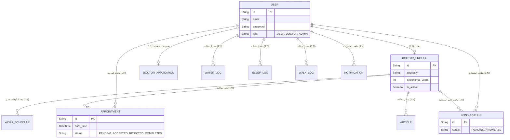
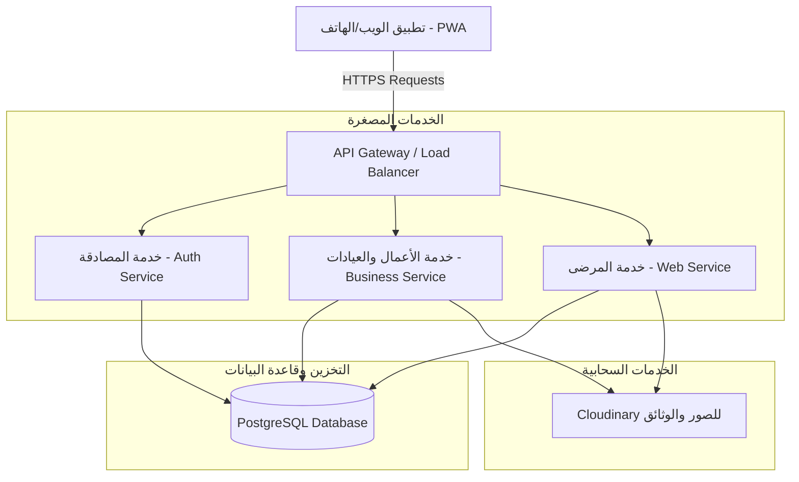
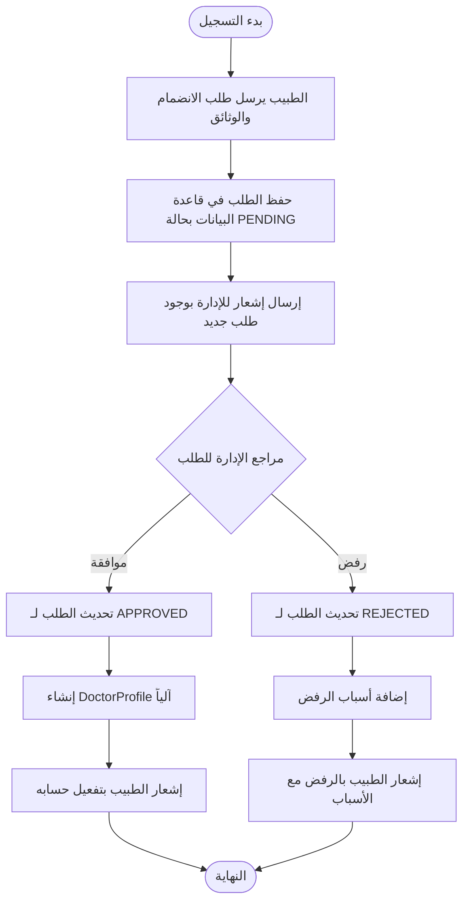
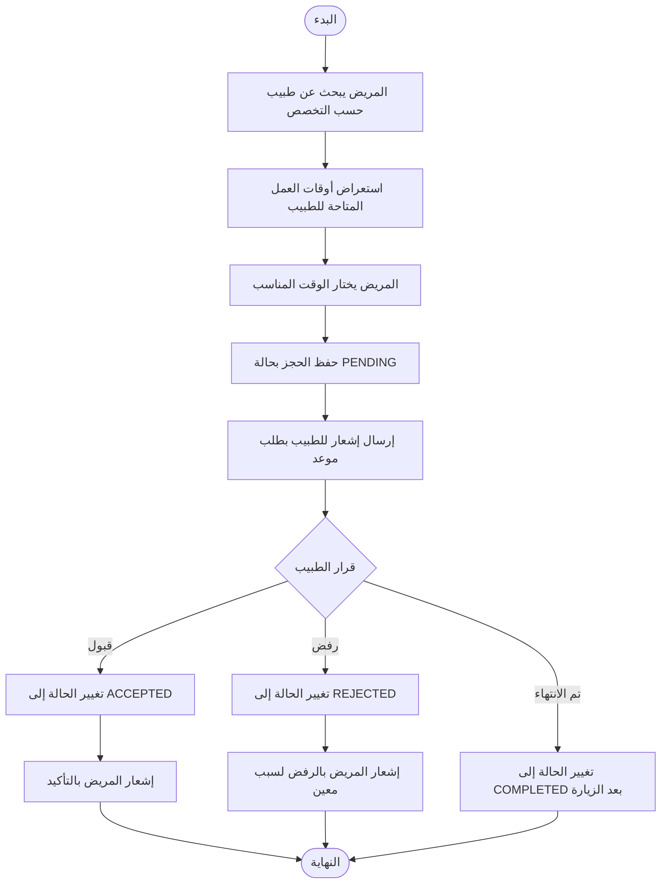
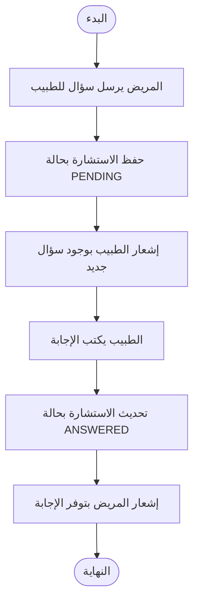
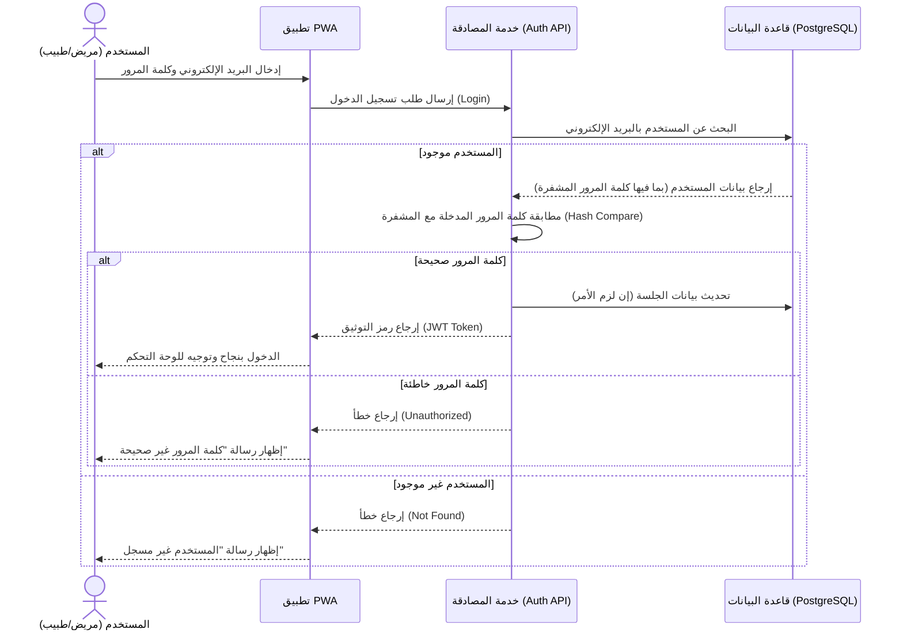
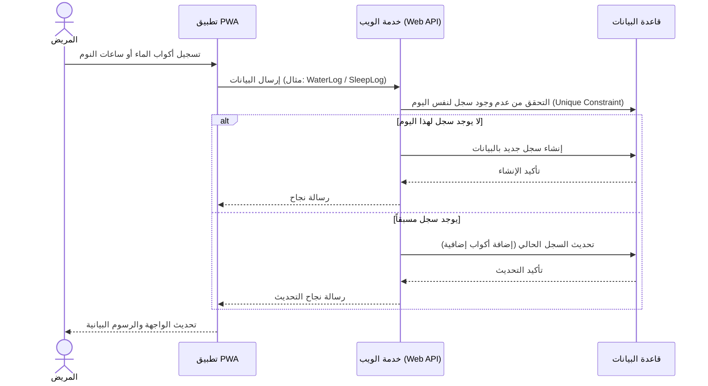

# المخططات الهيكلية لمنصة الرعاية الصحية (HealthCare Platform Diagrams)

هذا الملف يحتوي على المخططات الهندسية الدقيقة لمشروعك، مبنية على بنية قاعدة البيانات `schema.prisma` وباستخدام المصادقة التقليدية (البريد الإلكتروني وكلمة المرور) وبدون استخدام التخزين المؤقت الإضافي.

---

## 1. مخطط الكيانات والعلاقات (ERD - Entity Relationship Diagram)

---

## 2. المخطط البيئي / المعماري (Environmental Diagram)
يوضح المعمارية الفعلية للمشروع المكونة من الخدمات المصغرة واعتمادها المباشر على PostgreSQL.

---

## 3. مخططات العمليات (Process / Activity Diagrams)

### العملية الأولى: تسجيل واعتماد طبيب جديد (Doctor Application Flow)

### العملية الثانية: حجز وإدارة موعد طبي (Appointment Booking Flow)

### العملية الثالثة: طلب استشارة طبية (Consultation Flow)

---

## 4. مخططات التتابع (Sequence Diagrams)

### مخطط التتابع 1: تسجيل الدخول (Email & Password Authentication)

### مخطط التتابع 2: تتبع الحالة الصحية (Health Tracking - Water/Sleep)

